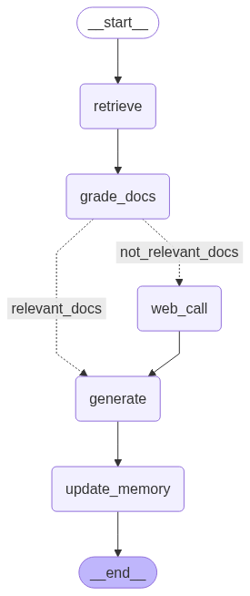
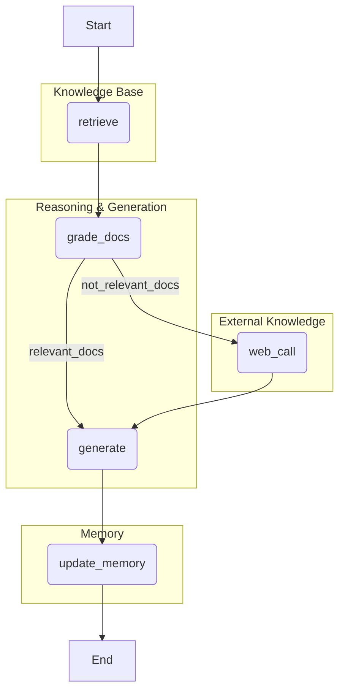

# 🧠 Personalized Bengali RAG Tutor with Agentic Memory

This project implements a sophisticated, personalized AI tutor for Bengali literature. It leverages an **Agentic RAG (Retrieval-Augmented Generation)** architecture to provide accurate, context-aware, and personalized answers. The system features both short-term (conversational) and long-term (user profile) memory, allowing it to remember user details and past topics across different sessions.

The core of the system is an agent built with LangChain and LangGraph. This agent can reason about its steps, dynamically deciding whether to answer from a vectorized knowledge base or perform a web search if the initial context is insufficient. The entire system is served via a FastAPI backend and includes a user-friendly Streamlit interface for interaction.

## ✨ Key Features

*   **Agentic RAG Architecture:** The system uses a state machine (graph) to intelligently decide its course of action, including retrieving documents, grading their relevance, and falling back to web search.
*   **Long-Term Memory:** Remembers user-specific details like name, grade, and topics of interest across multiple sessions, creating a truly personalized learning experience.
*   **Short-Term Memory:** Maintains conversational context within a single session, allowing for natural follow-up questions.
*   **Dynamic Tool Use:** Automatically switches between a private knowledge base (Pinecone) and a public web search (Google Serper) to ensure the most relevant answers.
*   **Open-Source & Efficient:** Built with powerful open-source models like `llama3-8b-8192` (via Groq) and `sentence-transformers/all-mpnet-base-v2`.
*   **Production-Ready Stack:** Deployed with a FastAPI backend and a Streamlit frontend, demonstrating a full-stack application.
*   **Integrated Tracing:** Leverages LangSmith for full observability and debugging of the agent's reasoning process.
*   **Quantified Performance:** Includes a full evaluation suite to measure and prove the system's accuracy and relevance.

## 🏛️ System Architecture

The agent's logic is structured as a graph, where each node represents a step in the reasoning process. The agent dynamically traverses this graph based on the relevance of the retrieved information.





<hr>

## 🛠️ Technology Stack & Tools
- **Backend**: FastAPI, Uvicorn
- **Frontend**: Streamlit
- **LLM & Orchestration**: LangChain, LangGraph, LangSmith
- **LLM Provider:** Groq (for Llama 4)
- **Vector Database:** Pinecone
- **Embedding Model:** Hugging Face sentence-transformers/all-mpnet-base-v2
- **Web Search:** Google Serper API
- **Core Libraries:** python-dotenv, pydantic, trustcall


## 🚀 Setup and Installation Guide
Follow these steps to get the project running on your local machine.
1. Clone the Repository
```bash

git clone <your-repository-url>
cd <repository-name>
```

```bash
2. Set Up a Virtual Environment (Recommended)

# For Windows
python -m venv venv
venv\Scripts\activate

# For macOS/Linux
python3 -m venv venv
source venv/bin/activate
```

3. Install Dependencies
```bash
pip install -r requirements.txt
```

## 4. Configure Environment Variables
Create a file named .env in the root directory by copying the example file:
```bash
# For Windows
copy .env.example .env

# For macOS/Linux
cp .env.example .env
```

Now, open the .env file and fill in your actual API keys from Groq, Pinecone, Hugging Face, and SERP API.

## 5. Run the Backend Server
The backend is a FastAPI application. Run it from the root directory:
```bash
uvicorn app.main:app --reload
```
The API will be available at http://127.0.0.1:8000. You will see log messages in this terminal

## 6. Run the Frontend Application
Open a new terminal, activate the virtual environment again, and run the Streamlit app:
```bash
streamlit run streamlit_app.py
```
Your web browser will open with the chatbot interface, ready for you to interact with.

## 📝 API Documentation
The FastAPI backend provides two main endpoints.
1. Chat Endpoint
This is the main endpoint for interacting with the agent.
Endpoint: POST /chat
Request Body:
```json
Generated json
{
  "query": "আপনার প্রশ্ন এখানে লিখুন",
  "user_id": "unique_student_id",
  "thread_id": "unique_session_id"
}
```