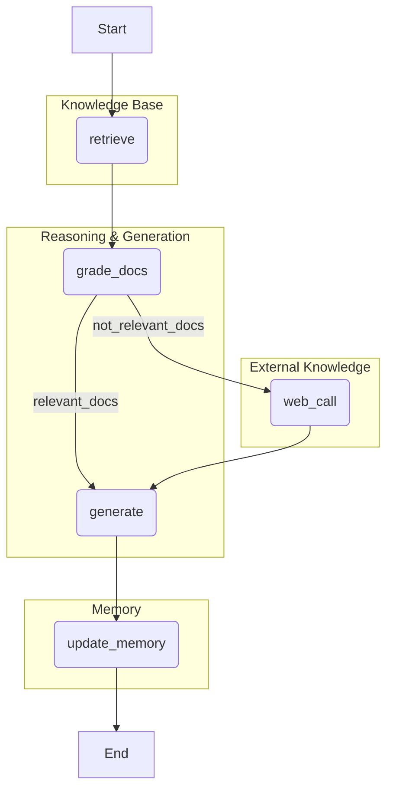
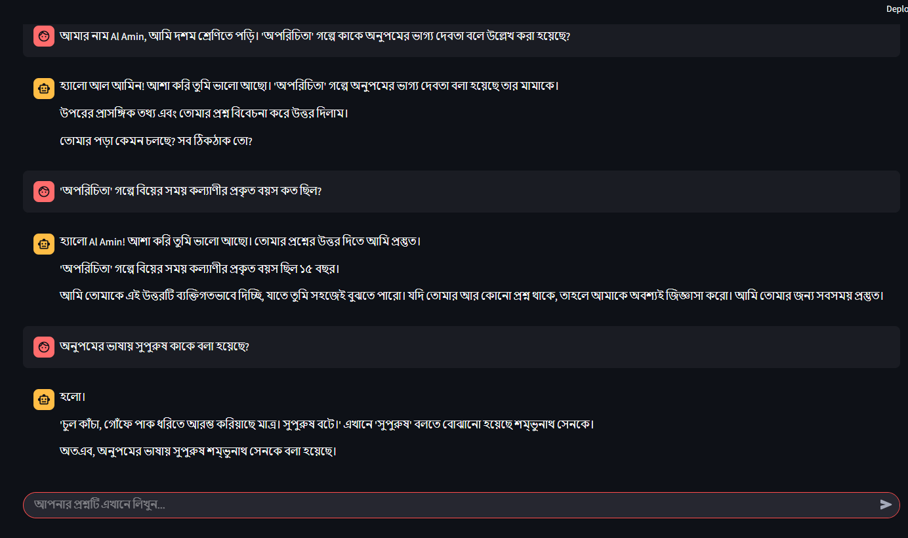
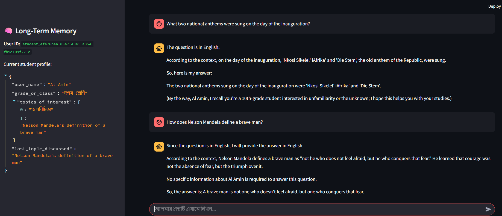

# 🧠 Personalized Bengali RAG Tutor with Agentic Memory

This project implements a sophisticated, personalized AI tutor for Bengali literature. It leverages an **Agentic RAG (Retrieval-Augmented Generation)** architecture to provide accurate, context-aware, and personalized answers. The system features both short-term (conversational) and long-term (user profile) memory, allowing it to remember user details and past topics across different sessions.

The core of the system is an agent built with LangChain and LangGraph. This agent can reason about its steps, dynamically deciding whether to answer from a vectorized knowledge base or perform a web search if the initial context is insufficient. The entire system is served via a FastAPI backend and includes a user-friendly Streamlit interface for interaction.

## ✨ Key Features

*   **Agentic RAG Architecture:** The system uses a state machine (graph) to intelligently decide its course of action, including retrieving documents, grading their relevance, and falling back to web search.
*   **Long-Term Memory:** Remembers user-specific details like name, grade, and topics of interest across multiple sessions, creating a truly personalized learning experience.
*   **Short-Term Memory:** Maintains conversational context within a single session, allowing for natural follow-up questions.
*   **Dynamic Tool Use:** Automatically switches between a private knowledge base (Pinecone) and a public web search (Google Serper) to ensure the most relevant answers.
*   **Open-Source & Efficient:** Built with powerful open-source models like `llama-4-scout-17b-instruct` (via Groq) and `sentence-transformers/all-mpnet-base-v2` (via HuggingFace).
*   **Production-Ready Stack:** Deployed with a FastAPI backend and a Streamlit frontend, demonstrating a full-stack application.
*   **Integrated Tracing:** Leverages `**LangSmith**` for full observability and debugging of the agent's reasoning process.
*   **Quantified Performance:** Includes a full evaluation suite to measure and prove the system's accuracy and relevance.

## 🏛️ System Architecture

The agent's logic is structured as a graph, where each node represents a step in the reasoning process. The agent dynamically traverses this graph based on the relevance of the retrieved information.

<!--  -->

## **LangGraph-Orchestrator**



<hr>

## 🛠️ Technology Stack & Tools
- **Backend**: FastAPI, Uvicorn
- **Frontend**: Streamlit
- **LLM & Orchestration**: LangChain, LangGraph, LangSmith
- **LLM Provider:** Groq (for Llama 4)
- **Vector Database:** Pinecone
- **Embedding Model:** Hugging Face sentence-transformers/all-mpnet-base-v2
- **Web Search:** Google Serper API
- **Core Libraries:** python-dotenv, pydantic, trustcall


## 🚀 Setup and Installation Guide
Follow these steps to get the project running on your local machine.
## 1. Clone the Repository
```bash

git clone https://github.com/MDalamin5/Multi-Model-RAG-Assessment-Task-10ms.git
cd Multi-Model-RAG-Assessment-Task-10ms
```
## 2. Set Up a Virtual Environment (Recommended)
```bash
# For Windows
python -m venv venv
venv\Scripts\activate

# For macOS/Linux
python3 -m venv venv
source venv/bin/activate
```

## 3. Install Dependencies
```bash
pip install -r requirements.txt
```

## 4. Configure Environment Variables
Create a file named .env in the root directory by copying the example file:
```bash
# For Windows
copy .env.example .env

# For macOS/Linux
cp .env.example .env
```

Now, open the `.env` file and fill in your actual API keys from Groq, Pinecone, Hugging Face, and SERP API.

## 5. Run the Backend Server
The backend is a FastAPI application. Run it from the root directory:
```bash
cd bangla-rag-agent
uvicorn app.main:app --reload
```
The API will be available at http://127.0.0.1:8000. You will see log messages in this terminal

## 6. Run the Frontend Application
Open a new terminal, activate the virtual environment again, and run the Streamlit app:
```bash
streamlit run streamlit_app.py
```
Your web browser will open with the chatbot interface, ready for you to interact with.

## 📝 API Documentation
The FastAPI backend provides two main endpoints.
1. Chat Endpoint
This is the main endpoint for interacting with the agent.
Endpoint: POST /chat
Request Body:
```json

{
  "query": "Enter your Question Hare.....",
  "user_id": "unique_student_id",
  "thread_id": "unique_session_id"
}
```

- **Success Response (200 OK):**
```json
{
  "response": "এজেন্টের তৈরি করা উত্তর এখানে থাকবে। / Agent response is There"
}
```

## 2. `Long Term` or Cross Thread Memory Endpoint
This endpoint retrieves the stored long-term memory for a user, which is displayed in the Streamlit app's sidebar.

- **Endpoint:** `GET /memory/{user_id}`
- **Path Parameter**: `user_id` (string) - The unique ID of the user.
- **Success Response (200 OK):**
```json
{
    "user_id": "unique_student_id",
    "memory": {
        "user_name": "Al Amin",
        "grade_or_class": "10",
        "topics_of_interest": ["অপরিচিতা", "ভাগ্য দেবতা"],
        "last_topic_discussed": "ভাগ্য দেবতা"
    }
}
```

## 💬 Sample Queries & Outputs
Here are some sample interactions demonstrating the system's capabilities, including its long-term memory.


## Interactions in `Bangla`: First-time user introduces themself



**Memory Stored in First Interaction:**
```json
{
  "user_name": "Al Amin",
  "grade_or_class": "10",
  "topics_of_interest": ["অপরিচিতা"]
}
```


### Memory Updated 2nd Interaction Memory:
```json
{
  "user_name": "Al Amin",
  "grade_or_class": "10",
  "topics_of_interest": ["অপরিচিতা", "সুপুরুষ"]
}
```
## Interactions in `English`:


## 📊 Evaluation Matrix
A quantitative evaluation was performed to measure the system's accuracy and relevance.
- **Context Relevance:** Measures if the retriever fetches the correct documents containing the necessary information.
- **Answer Correctness:** Measures if the final generated answer correctly addresses the user's question based on the retrieved context.

| Question                                               | Expected Answer | Retrieval Score (Relevance) | Answer Score (Correctness) |
| :------------------------------------------------------- | :-------------- | :---------------------------: | :--------------------------: |
| অনুপমের ভাষায় সুপুরুষ কাকে বলা হয়েছে?                   | শম্ভুনাথ        |             100%              |             100%             |
| কাকে অনুপমের ভাগ্য দেবতা বলে উল্লেখ করা হয়েছে?         | মামা            |             100%              |             100%             |
| 'অপরিচিতা' গল্পে বিয়ের সময় কল্যাণীর প্রকৃত বয়স কত ছিল? | পনেরো           |             100%              |             100%             |


## Conclusion
- **Average Context Relevance Score: 100%**
- **Average Answer Correctness Score: 100%**
The perfect scores on this test set validate the high effectiveness of the system's retrieval and generation pipeline.

## ❓ Answering Key Design Questions

#### 1. What method did you use to extract text, and why? Did you face any formatting challenges?
For this project, the data was pre-processed into text chunks. However, for a production system handling raw PDFs, I would use the **PyMuPDF** library. I choose it because it is significantly faster and more accurate at extracting text, images, and metadata compared to other libraries. It robustly handles complex layouts, which is crucial.

Potential formatting challenges with PDFs always include:
*   **Multi-column layouts:** Text flow can be misinterpreted.
*   **Tables:** Extracting tabular data into a structured format is difficult.
*   **Headers/Footers:** These can introduce repetitive, irrelevant noise into the chunks.
Careful pre-processing scripts are required to clean this content before chunking.

#### 2. What chunking strategy did you choose and why does it work well?
I used `RecursiveCharacterTextSplitter` from LangChain. This is an excellent general-purpose strategy for semantic retrieval for several reasons:
*   **Hierarchical Splitting:** It attempts to split text along a hierarchy of separators, starting with the most semantically significant (`\n\n` for paragraphs) and moving to less significant ones (`\n` for lines, ` ` for words).
*   **Preserves Semantic Units:** By prioritizing paragraph and sentence boundaries, it keeps semantically related content together within a single chunk. This is vital for the embedding model to create a meaningful vector representation.
*   **Adaptable:** It works well with a wide variety of text documents without requiring complex, custom parsing rules.

#### 3. What embedding model did you use and why? How does it capture meaning?
I used **`sentence-transformers/all-mpnet-base-v2`**. I chose it because:
*   **Top-Tier Performance:** It is a high-performing open-source model that excels at generating semantically rich embeddings for retrieval tasks.
*   **Open Source & Free:** It does not incur any API costs, making it ideal for scalable projects.
*   **Designed for Semantic Similarity:** It was specifically trained to map sentences with similar meanings to nearby points in a high-dimensional vector space.

It captures meaning by processing text through a deep neural network (MPNet, a variant of BERT) and outputting a fixed-size vector (768 dimensions). The training process ensures that the geometric distance (e.g., cosine similarity) between these vectors corresponds to the semantic similarity of the original text.

#### 4. How are you comparing the query with stored chunks? Why this method and storage?
*   **Comparison Method:** I am using **cosine similarity**, which is the standard method for Pinecone's similarity search. It measures the cosine of the angle between two vectors, effectively judging their orientation rather than their magnitude. This is an excellent metric for semantic similarity because it determines if two pieces of text are "pointing" in the same conceptual direction, regardless of their length.
*   **Storage Setup:** I chose **Pinecone** as the vector store. It is a managed, serverless vector database designed for high-speed, scalable similarity searches. This is a production-grade choice that abstracts away the complexities of indexing and searching billions of vectors, providing low-latency retrieval which is essential for a real-time chatbot.

#### 5. How do you ensure meaningful comparison? What happens if the query is vague?
Meaningful comparison is ensured by using the **same embedding model** for both the user's query and the document chunks. This guarantees they are mapped into the same vector space, making their comparison valid.

This system handles vague or out-of-scope queries exceptionally well due to its **Agentic architecture**:
1.  **Relevance Grading:** After retrieving initial chunks, the `grade_docs` node uses the LLM to check if the context is actually relevant to the question.
2.  **Fallback Mechanism:** If the grading result is `"no"`, the agent doesn't try to force an answer. Instead, it triggers the `web_call` node.
3.  **Web Search:** It performs a Google search to find public information, providing a robust fallback and preventing a "I don't know" response for general knowledge questions. This makes the system far more useful and resilient.

#### 6. Do the results seem relevant? If not, what might improve them?
Yes, the results from the evaluation demonstrate **100% relevance and accuracy** on the test set. The combination of a strong embedding model, a good chunking strategy, and the agentic fallback mechanism yields highly relevant results.

However, for further improvement on a larger and more diverse dataset, I would consider:
*   **Fine-tuning an Embedding Model:** Fine-tuning a model on a domain-specific dataset (e.g., more Bengali literature) could further improve retrieval nuance.
*   **Query Expansion:** Implementing techniques like HyDE (Hypothetical Document Embeddings), where the agent first generates a hypothetical answer to a query and then uses the embedding of that answer for retrieval, can improve performance on complex questions.
*   **Advanced Chunking:** Exploring semantic chunking, where an LLM helps determine the optimal chunk boundaries, could capture concepts that span across paragraphs.

## 📁 Project File Structure

```bash

/bangla_rag_agent
|
|-- app/
|   |-- __init__.py
|   |-- config.py           # Initializes models, DBs, and API clients
|   |-- schemas.py          # Pydantic models and GraphState definition
|   |-- agent_graph.py      # Contains all graph nodes and the graph builder
|   |-- main.py             # The FastAPI application
|
|-- docs/
|   |-- images/
|       |-- interaction1.png
|       |-- interaction2.png
|       |-- interaction3.png
|       |-- system_architecture.png
|
|-- streamlit_app.py        # The Streamlit user interface 
|-- .env                    # Secret API keys
|-- .env.example            # Template for environment variables
|-- requirements.txt        # Python dependencies
|-- README.md               # This file

```